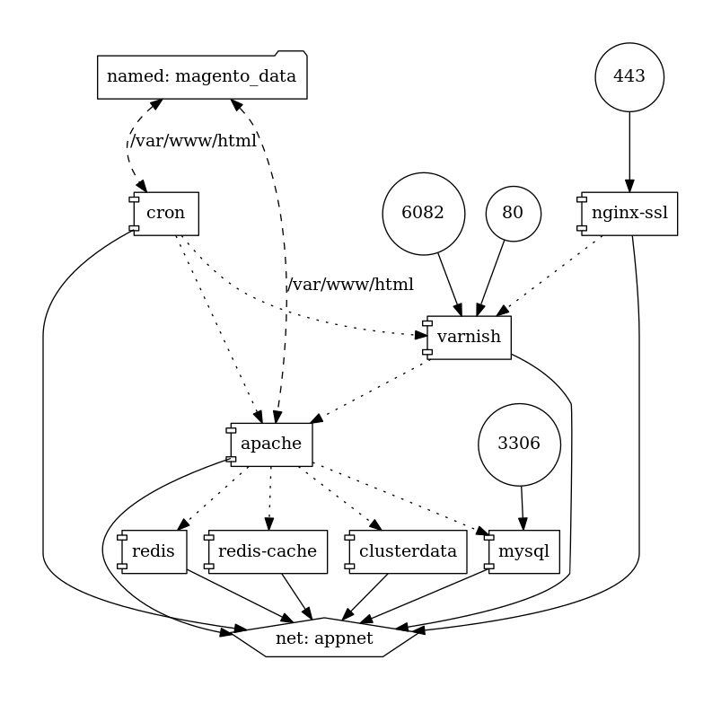
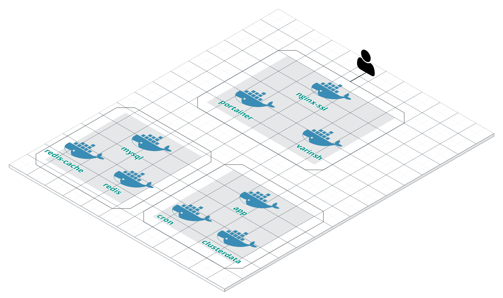

# Dockerized Magento 1

> This is a Work In Progress Project based on : https://github.com/fballiano/docker-magento2

### You can run this project in standalone environment or in a swarm cluster



## How To Run :


#### In your local machine

```bash
  $ docker-compose up -d
```

And go to `https://localhost`

#### In a Swarm Cluster

First, you need to create the instances ( 1 master & 2 slaves ) and fill in the hosts files with the IPs.
Verify that you have Ansible Installed, and ssh established with the instances, and run :

```bash
  $ ansible-playbook -i hosts main.yml
  $ ansible-playbook -i hosts swarm/swarm-playbook/stack.yml
```




Note that the swarm cluster use Digital Ocean Block Storage to save data into volumes, using  the  [rexray/dobs plugins](https://rexray.readthedocs.io/en/stable/user-guide/schedulers/docker/plug-ins/digitalocean/), so we can scale the containers and restore the state of the application when one nodes goes down.

There are 5 volumes in total :

 - mysql_data: For Mysql  data
 - redis_datan: For session data
 - cache_data: For magento cache
 - data: For magento source code
 - cluster_data: For general cluster data


